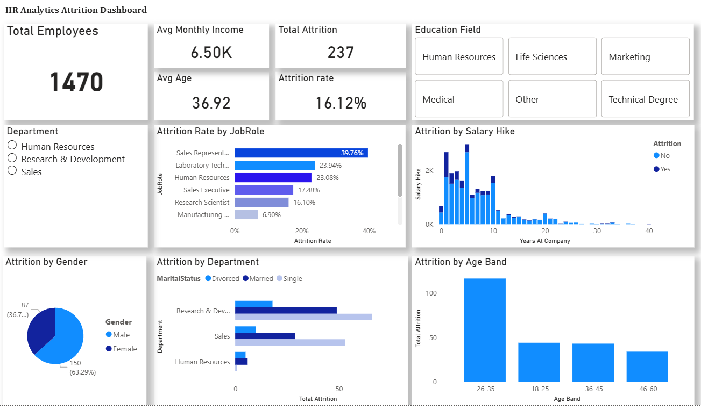
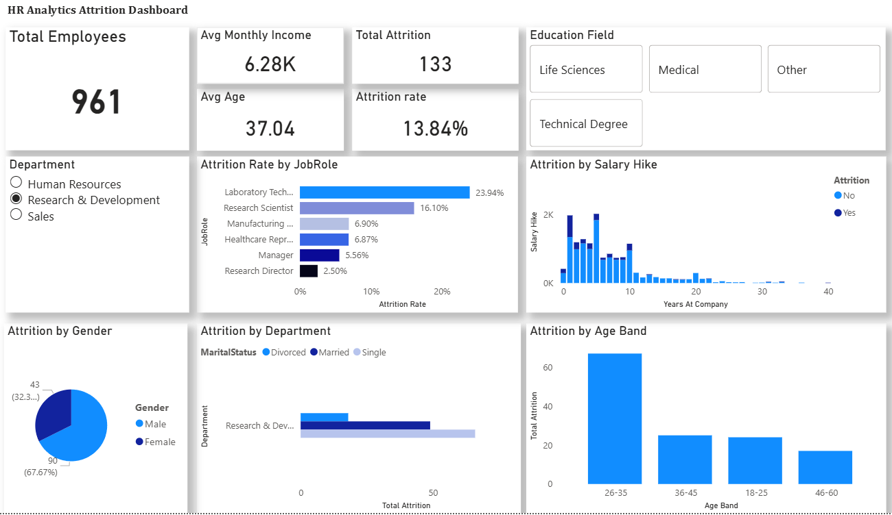
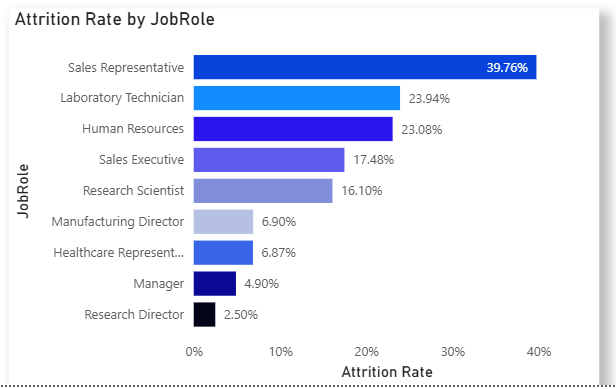

# HR-Analytics-Employee-Attrition
Power BI dashboard analyzing employee attrition patterns
# HR Analytics Dashboard – Employee Attrition Insights

## 📊 Project Overview
This project analyzes employee attrition using an interactive Power BI dashboard to help HR teams identify retention risks and make data-driven decisions.

## 🔍 Key Insights
- Overall attrition rate is approximately **16%**
- Highest attrition observed in the **26–35 age group**
- **Sales and R&D** departments experience higher attrition
- Employees with **lower salary hikes** show higher attrition trends

## 🛠 Tools Used
- Power BI
- DAX
- Power Query

## 📈 Dashboard Features
- KPI cards for quick HR metrics
- Attrition analysis by department, age group, job role, and gender
- Salary hike vs attrition analysis
- Interactive slicers for department and education field

## 📸 Dashboard Preview
### Overall Dashboard

### Filtered View

### Attrition by Job Role

## 🎥 Walkthrough
A Loom walkthrough video will be added soon.

---

## 📌 Author
Rahul Kumar  
Aspiring Data Analyst
